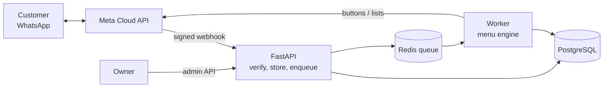

# Tee Concierge

[](https://github.com/rodycastillo/tee-concierge/actions/workflows/ci.yml)


A WhatsApp assistant that serves **any business without programming**, written in Python. The business and its menu are a YAML file: a tree of options, each with a **code** the customer can tap or type. Customers greet the bot and get an interactive menu; when they need a person, the bot gives them the business's contact number. Two examples ship in [`examples/`](examples): a T-shirt store (with a data-driven catalog of sizes and stock) and a dental clinic (menus and text only).

It is built as a portfolio project to show production-minded backend engineering: a correct webhook, a testable architecture and a menu engine whose WhatsApp limits are enforced in code. Everything runs locally with one command and **no Meta account**, thanks to a fake WhatsApp gateway.

```
tú> Hola
bot> ¡Hola, Cliente! 👋 Bienvenido a Tee Concierge. ¿En qué te puedo ayudar?
      [1] 👕 Ver catálogo   [2] 📏 Guía de tallas   [3] 🚚 Envíos   [4] 💳 Formas de pago
      [5] 🔁 Cambios/devoluciones   [6] 🕒 Horarios y ubicación   [7] 📞 Contáctanos
tú> 1
bot> 👕 Nuestro catálogo. Elige una categoría:   [1] Básicas  [2] Estampadas  [3] Oversize ...
tú> 2
bot> 👕 Estampadas. Elige un producto:   [1] Polo Machu Picchu  [2] Polo Cóndor Andino ...
tú> 1
bot> Polo Machu Picchu · 💰 S/ 59.90 · 🧵 Algodón pima 100%   [1] 📏 Tallas y colores ...
tú> 1
bot> 📏 Elige tu talla:   [1] Talla S  [2] Talla M  [3] Talla L  [4] Talla XL ...
tú> 2
bot> Polo Machu Picchu · Talla M
     • Negro: disponible
     • Beige: disponible
```

(Condensed from the real output of `make chat`. In the terminal you tap options by number; on WhatsApp they are buttons and list rows.)

## Quick start

Requires Docker and [uv](https://docs.astral.sh/uv/).

```bash
cp .env.example .env
make up        # api, worker, postgres, redis (runs migrations)
make seed      # load a synthetic demo catalog (T-shirt example only)
make menu      # validate every menu file in examples/
make chat      # talk to the bot in your terminal
make smoke     # end-to-end test against the running stack
make check     # ruff, mypy --strict, import-linter, pytest
```

API docs at <http://localhost:8000/docs>. To serve another business, point `MENU_CONFIG` at its file (see [Configure a business](#configure-a-business)). To connect a real WhatsApp number, follow [docs/08](docs/08-meta-whatsapp-setup.md) and set `WHATSAPP_GATEWAY=cloud`.

## Configure a business

One business per deployment. The menu is a YAML file chosen with `MENU_CONFIG`:

```yaml
business:
  name: Sonrisa Clara
  hours: "Lun a Vie, 9:00 a 20:00"
menu:
  - id: services
    type: menu                    # menu | text | contact | catalog
    title: "🦷 Servicios"
    body: "Elige un servicio:"
    children:
      - {id: cleaning, type: text, title: Limpieza dental, body: "45 minutos."}
  - {id: appointments, type: text, title: Agendar cita, code: cita, body: "Atendemos {hours}."}
  - {id: contact, type: contact, title: "📞 Contáctanos"}
```

- Codes are automatic by position (`1`, `1.2`, ...) or set with `code:`. A customer can **tap an option or type its code** from any screen; `0` returns to the main menu.
- Text supports `{business}`, `{hours}`, `{phone}` and `{link}`. Customer-facing strings (buttons, fallbacks) are Spanish by default and can be overridden under `messages:`.
- `tee-menu validate <file>` (and `make menu`, and CI) checks the schema, structural rules (unique ids and codes, WhatsApp limits) and renders every reachable screen. The worker runs the same checks at startup, so a broken file fails the deploy, not a customer.
- `STORE_NAME`, `STORE_CONTACT_PHONE` and `STORE_HOURS` override the file, so real contact data is never committed. See [ADR-0007](docs/adr/0007-configurable-menu-with-codes.md).

## How it works



1. **The webhook only verifies, stores and enqueues**, then returns 200. Meta retries slow responses, so replies are produced by a worker ([ADR-0003](docs/adr/0003-async-webhook-processing.md)).
2. **Each message is processed once**: the WhatsApp message id is unique in the database, retries are ignored, and a per-customer Redis lock keeps one customer's messages in order.
3. **The menu engine** turns a tap, a keyword or free text into the next screen. It is a tree of nodes built from the business's YAML file, not a chain of `if`s ([ADR-0005](docs/adr/0005-menu-driven-conversation.md), [ADR-0007](docs/adr/0007-configurable-menu-with-codes.md)).
4. **Replies respect WhatsApp's limits by construction.** A `Reply` that would have more than 3 buttons, 10 list rows or an over-long title cannot be built, so a bad menu fails in tests, not in front of a customer.

## Engineering highlights

| Concern | Approach |
|---|---|
| **Architecture** | Hexagonal: `domain` → `application` → `infrastructure` → `interfaces`. The dependency rule is enforced in CI with `import-linter` ([ADR-0002](docs/adr/0002-hexagonal-architecture.md)) |
| **Security** | HMAC signature on every webhook, constant-time comparisons, admin API that is *disabled* (404) unless a key is set, secrets as `SecretStr` ([threat model](docs/09-security-and-operations.md)) |
| **Idempotency** | Unique `wamid`; a retry re-enqueues a message that was stored but never queued, so a crash between the two steps cannot lose it |
| **Stale menus** | Option ids carry their own target (`go:product:4`), so a tap on yesterday's menu still works, and unknown ids fall back to the main menu |
| **Delivery receipts** | sent/delivered/read are applied monotonically; a late or out-of-order receipt can never downgrade a message |
| **Abuse control** | Per-customer rate limit in Redis; excess is dropped silently |
| **Resilience** | A screen that fails to render (e.g. bad admin data) falls back to a safe reply; usage tracking and "mark as read" are best-effort and never block an answer |
| **Observability** | JSON logs with the message id as correlation id, Prometheus metrics for API and worker, `/admin/stats` for menu usage |
| **Money** | `Decimal` everywhere, formatted as soles (`S/ 59.90`) |
| **Content** | Menu and copy are data (YAML, versioned and reviewable), validated in CI and at startup; default strings are Spanish and overridable per business |

## Quality

- **128 tests** (unit and integration), `mypy --strict`, `ruff`, and layer rules checked on every push.
- **Coverage 83%** overall; the domain and application layers are above 92%. The worker is covered by the end-to-end smoke test (`make smoke`) rather than unit tests.
- A dry run walks **every reachable screen** of each example menu, generated from the data, and fails on dead ends, broken links, orphan nodes or a WhatsApp limit violation.
- The CI pipeline runs the quality checks, builds the Docker image, then starts the whole stack and drives it end to end.

## Project layout

```
src/tee_concierge/
├── domain/           Pure Python: Reply (with WhatsApp limits), catalog, ports (Protocols)
├── application/
│   ├── engine/       Node registry, routing, state machine, catalog screens
│   ├── menu/         YAML schema, validation rules, builder, dry-run
│   ├── content/      Default (overridable) copy and business info
│   ├── ingest.py     Webhook payload -> stored messages + jobs
│   ├── process.py    One message -> one reply (lock, rate limit, mark read)
│   └── admin.py      Validated catalog management
├── infrastructure/   Menu file loader, WhatsApp gateways (Cloud API, fake), SQLAlchemy, Redis, arq worker, metrics
└── interfaces/api/   FastAPI: webhook, admin, dev outbox
migrations/           Alembic
examples/             Ready-to-run businesses: tshirt-store, dental-clinic
scripts/smoke_test.py End-to-end test
docs/                 Requirements, architecture, domain, conversation design, ADRs, security
```

## Documentation

| | |
|---|---|
| [Product requirements](docs/01-product-requirements.md) | Scope, personas, requirements |
| [Architecture](docs/02-architecture.md) | Context, containers, message pipeline |
| [Domain model](docs/03-domain-model.md) | Entities and ports |
| [Conversation design](docs/04-conversation-design.md) | Menu tree, limits, sessions, catalog screens |
| [Tech stack](docs/05-tech-stack.md) | Choices and alternatives |
| [Roadmap](docs/06-roadmap.md) | Phases and status |
| [Risks and open questions](docs/07-risks-and-open-questions.md) | |
| [Meta WhatsApp setup](docs/08-meta-whatsapp-setup.md) | Connect a real number |
| [Security and operations](docs/09-security-and-operations.md) | Threat model, limits, metrics, production checklist |
| [ADRs](docs/adr/) | Why each major decision was made |

## Status and honest limitations

Phases 1 to 7 are done, plus the configurable-menu rework (phase 8). See the [roadmap](docs/06-roadmap.md).

- **Not yet tested against the real WhatsApp Cloud API.** Interactive payloads and mark-as-read are covered by unit tests only.
- The catalog and the example menus are **synthetic demo data**. Editing the menu means editing the file and restarting; an admin import is a later step.
- One business per deployment (no multi-tenancy); one shared set of default strings, so per-node localization is out of scope.
- Delivery is at-least-once: a worker crash between sending and recording a reply can send it twice.
- No distributed tracing yet (logs carry a correlation id). More in [doc 9](docs/09-security-and-operations.md#92-known-limitations-honest-list).
- Out of scope by design: orders and payments in chat, an LLM.
