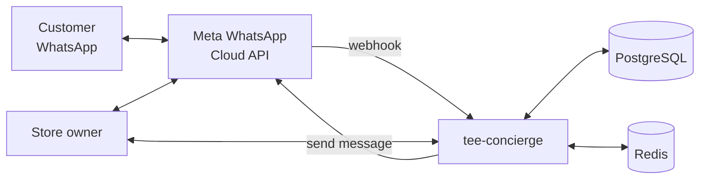
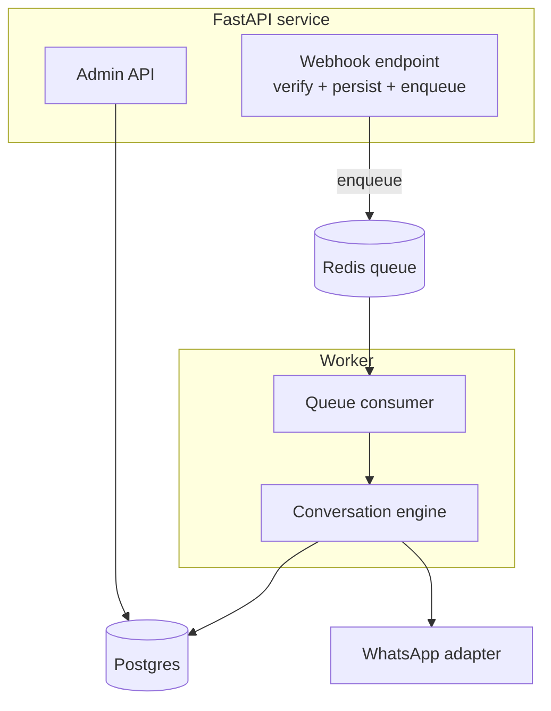
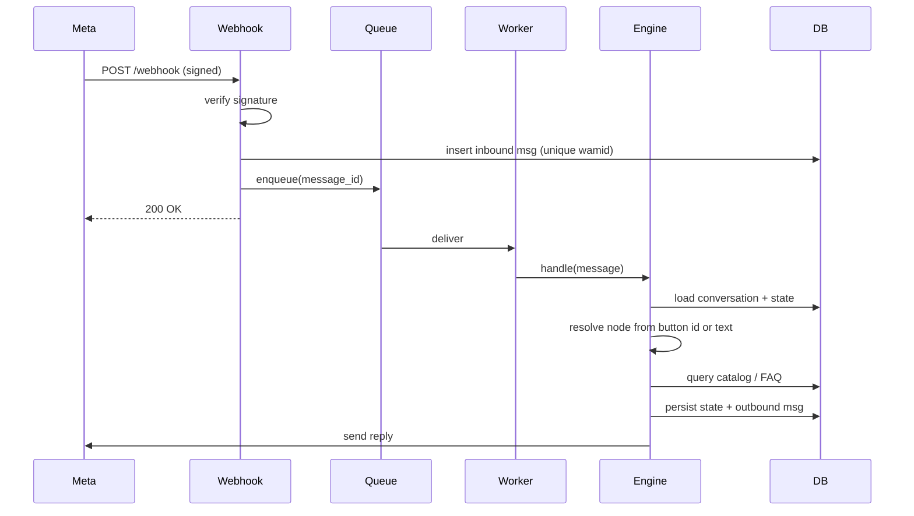

# 2. Architecture

## 2.1 Architectural style

**Hexagonal (ports and adapters) with a thin CQRS-flavored application layer.** The business logic does not know about WhatsApp, the database or any other provider. Those are adapters behind ports, which makes everything testable and swappable (for example Twilio instead of Meta Cloud API).

## 2.2 System context



## 2.3 Container view



Key decision: the **webhook only verifies, stores and enqueues**, then returns 200 right away. Meta retries on slow responses, so heavy work (DB reads, replies) happens in a worker. See [ADR-0003](adr/0003-async-webhook-processing.md).

## 2.4 Layers

```
interfaces/      FastAPI routers, request/response schemas, auth     -> depends on application
application/     Use cases, conversation engine, DTOs               -> depends on domain
domain/          Entities, value objects, domain services, ports    -> depends on nothing
infrastructure/  Adapters: Postgres, Redis, WhatsApp, notifications -> implements domain ports
```

Dependency rule: arrows point inward only. Enforced in CI with `import-linter`.

## 2.5 Message pipeline



## 2.6 Cross-cutting concerns

| Concern | Approach |
|---|---|
| **Idempotency** | Unique constraint on WhatsApp message id (`wamid`); duplicate insert means skip |
| **Ordering** | Per-conversation lock (Redis) so two messages from one customer never run in parallel |
| **Retries** | Exponential backoff with jitter; DLQ after N failures; outbound sends are idempotent via a stored status |
| **Config** | `pydantic-settings`, 12-factor, no secrets in the repo |
| **Logging** | `structlog` JSON, correlation id = wamid; phone numbers hashed or masked |
| **Metrics** | Prometheus: webhook latency, queue depth, reply latency, menu node usage, "Contáctanos" taps |
| **Tracing** | Not implemented. The message id is bound to every log line as a correlation id (see doc 9) |
| **Rate limiting** | Per-phone fixed window in Redis (20/min by default); excess dropped silently |
| **AuthN/Z** | Admin API: JWT or API key; webhook: HMAC signature |

## 2.7 Deployment

- **Local:** `docker compose up` starts api, worker, postgres, redis and a **fake WhatsApp gateway** (a small mock server plus a CLI chat) so anyone can try it without a Meta account.
- **Prod (demo):** a container host (Fly.io, Railway or Render) with managed Postgres and Redis.
- **CI/CD:** GitHub Actions runs lint (ruff), types (mypy), tests (pytest), import-linter, a container build and a deploy on tag.
- **Environments:** `local`, `staging` (Meta test number), `prod`.

## 2.8 Directory structure

See the layout in the [README](../README.md#project-layout). It follows the layers above one to one: `domain`, `application` (engine, content, ingest, process, admin), `infrastructure` (persistence, queue, whatsapp, worker, metrics) and `interfaces/api`.
