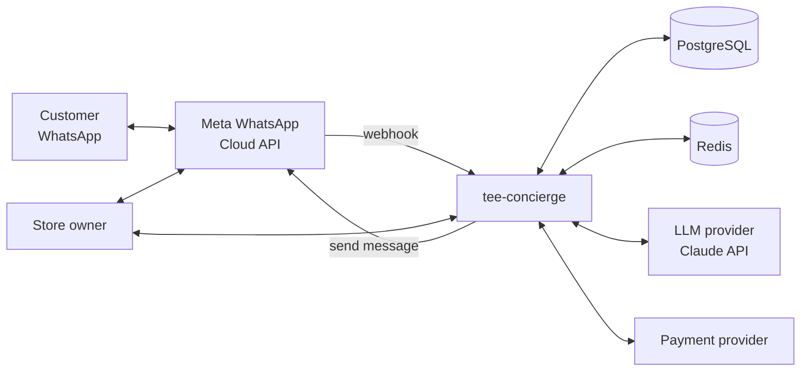
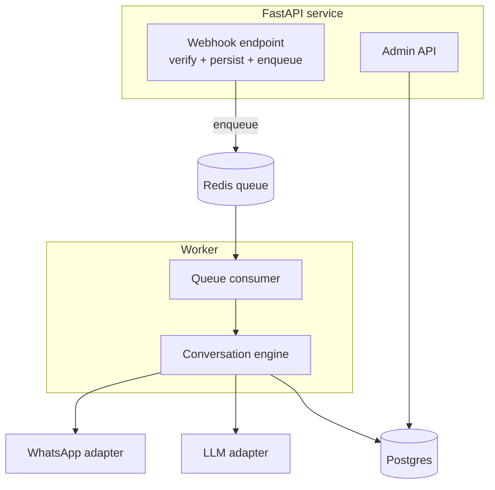
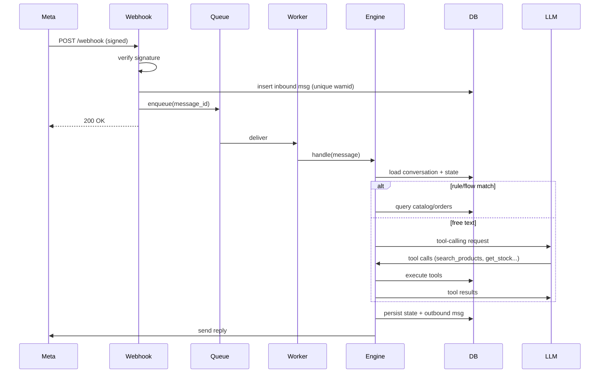

# 2. Architecture

## 2.1 Architectural style

**Hexagonal (ports and adapters) with a thin CQRS-flavored application layer.** The business logic does not know about WhatsApp, the database or the LLM. Those are adapters behind ports, which makes everything testable and swappable (for example Twilio instead of Meta Cloud API).

## 2.2 System context



## 2.3 Container view



Key decision: the **webhook only verifies, stores and enqueues**, then returns 200 right away. Meta retries on slow responses, so heavy work (LLM calls, DB reads) happens in a worker. See [ADR-0003](adr/0003-async-webhook-processing.md).

## 2.4 Layers

```
interfaces/      FastAPI routers, request/response schemas, auth     -> depends on application
application/     Use cases, conversation engine, DTOs               -> depends on domain
domain/          Entities, value objects, domain services, ports    -> depends on nothing
infrastructure/  Adapters: Postgres, Redis, WhatsApp, LLM, payments -> implements domain ports
```

Dependency rule: arrows point inward only. Enforced in CI with `import-linter`.

## 2.5 Message pipeline



## 2.6 Cross-cutting concerns

| Concern | Approach |
|---|---|
| **Idempotency** | Unique constraint on WhatsApp message id (`wamid`); duplicate insert means skip |
| **Ordering** | Per-conversation lock (Redis) so two messages from one customer never run in parallel |
| **Retries** | Exponential backoff with jitter; DLQ after N failures; outbound sends are idempotent via a stored status |
| **Config** | `pydantic-settings`, 12-factor, no secrets in the repo |
| **Logging** | `structlog` JSON, correlation id = wamid; phone numbers hashed or masked |
| **Metrics** | Prometheus: webhook latency, queue depth, LLM latency and tokens, handoff rate |
| **Tracing** | OpenTelemetry across webhook, worker, LLM and DB |
| **Rate limiting** | Per-phone token bucket in Redis to stop abuse and runaway cost |
| **AuthN/Z** | Admin API: JWT or API key; webhook: HMAC signature |

## 2.7 Deployment

- **Local:** `docker compose up` starts api, worker, postgres, redis and a **fake WhatsApp gateway** (a small mock server plus a CLI chat) so anyone can try it without a Meta account.
- **Prod (demo):** a container host (Fly.io, Railway or Render) with managed Postgres and Redis.
- **CI/CD:** GitHub Actions runs lint (ruff), types (mypy), tests (pytest), import-linter, a container build and a deploy on tag.
- **Environments:** `local`, `staging` (Meta test number), `prod`.

## 2.8 Proposed directory structure

```
src/tee_concierge/
├── domain/
│   ├── catalog/        Product, Variant, Money, Size
│   ├── customers/      Customer, PhoneNumber, Consent
│   ├── conversations/  Conversation, Message, ConversationState
│   ├── orders/         Cart, Order, OrderStatus
│   └── ports/          ProductRepository, MessageGateway, LLMClient, ...
├── application/
│   ├── engine/         Router, intent classifier, state machine, tool registry
│   ├── use_cases/      SearchProducts, CheckStock, GetOrderStatus, HandoffToHuman, ...
│   └── dto.py
├── infrastructure/
│   ├── whatsapp/       Cloud API client, payload parsers, fake gateway
│   ├── persistence/    SQLAlchemy models, repositories, Alembic
│   ├── llm/            Claude adapter, prompt templates
│   ├── queue/          Redis queue
│   └── payments/
├── interfaces/
│   ├── webhook/        Verify + ingest
│   └── admin/          REST API
└── config.py
```
