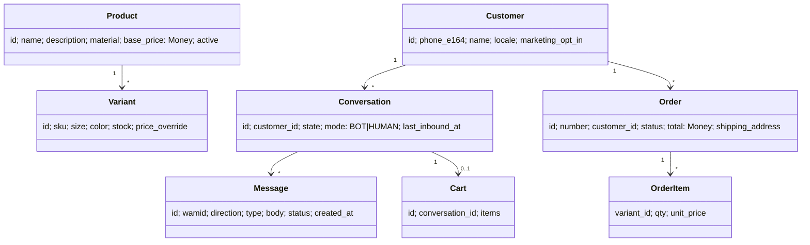

# 3. Domain Model

## 3.1 Ubiquitous language

| Term | Meaning |
|---|---|
| **Product** | A T-shirt design (name, description, material, base price) |
| **Variant** | A purchasable SKU: Product + size + color, with its own stock |
| **Conversation** | A thread with one customer phone number |
| **Handoff** | Bot yields control to a human; the bot stays silent until resumed |
| **Cart** | Draft of variants and quantities inside a conversation |
| **Service window** | The 24h after the customer's last message, when free-form replies are allowed |

## 3.2 Aggregates



Aggregate roots: `Product` (with variants), `Customer`, `Conversation` (with messages), `Order`.

## 3.3 Value objects and invariants

- `Money(amount: Decimal, currency)` never uses floats.
- `PhoneNumber` is normalized to E.164 at the boundary.
- `Size` is an enum (XS to XXL).
- Invariants: stock is never negative. An order cannot ship before payment. A conversation in `HUMAN` mode is never answered by the bot.

## 3.4 Ports (interfaces owned by the domain)

```python
class ProductRepository(Protocol):
    def search(self, query: ProductQuery) -> list[Product]: ...
    def get_variant(self, sku: str) -> Variant | None: ...

class MessageGateway(Protocol):          # outbound WhatsApp
    async def send_text(self, to: PhoneNumber, body: str) -> SentMessage: ...
    async def send_buttons(self, to: PhoneNumber, body: str, buttons: list[Button]) -> SentMessage: ...

class LLMClient(Protocol):
    async def complete(self, messages: list[LLMMessage], tools: list[ToolSpec]) -> LLMResponse: ...

class ConversationRepository(Protocol): ...
class OrderRepository(Protocol): ...
class Notifier(Protocol): ...            # owner notifications
class Clock(Protocol): ...               # makes the 24h window testable
```

## 3.5 Persistence sketch (PostgreSQL)

| Table | Key columns |
|---|---|
| `products` | id, name, description, material, base_price, active |
| `variants` | id, product_id, sku (unique), size, color, stock, price_override |
| `customers` | id, phone_e164 (unique), name, locale, marketing_opt_in, created_at |
| `conversations` | id, customer_id, state (jsonb), mode, last_inbound_at |
| `messages` | id, conversation_id, wamid (**unique**), direction, type, body, status, created_at |
| `carts` / `cart_items` | conversation_id, variant_id, qty |
| `orders` / `order_items` | number (unique), customer_id, status, total, address (jsonb) |
| `faq_entries` | id, topic, locale, answer, embedding (optional, pgvector) |
| `handoffs` | id, conversation_id, reason, created_at, resolved_at |
| `processed_events` | event_id (unique), for payment webhook idempotency |

Indexes: `messages(conversation_id, created_at)`, `variants(product_id)`, `conversations(customer_id)`.
Migrations: Alembic. Seed data: a script that generates a realistic demo catalog.
