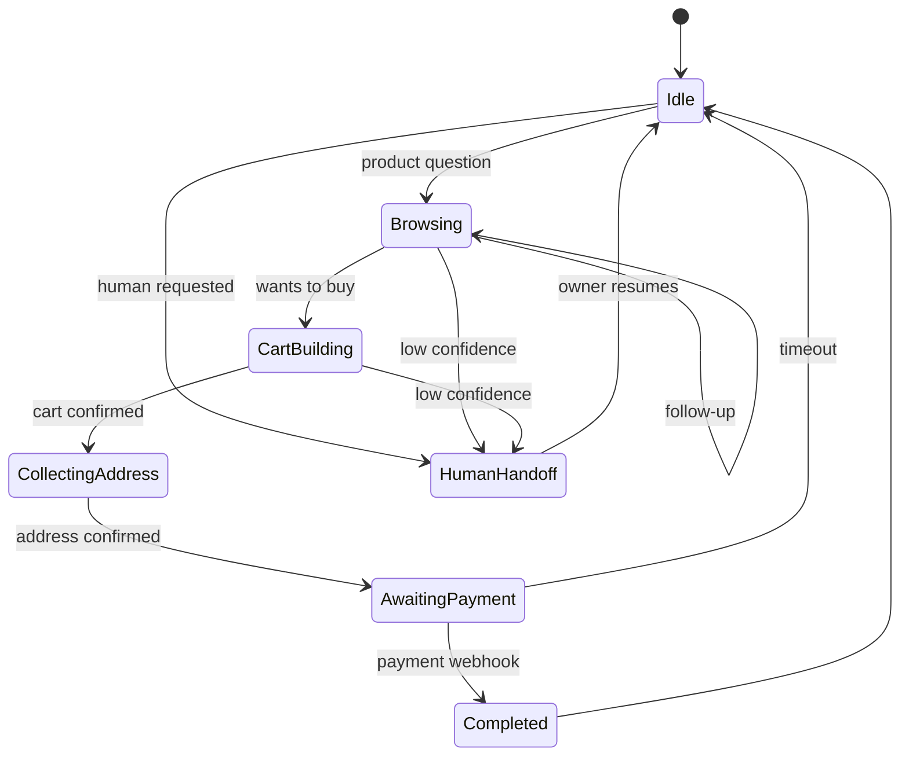

# 4. Conversation Design

## 4.1 Principle: deterministic where it matters, LLM where it helps

| Concern | Handled by | Why |
|---|---|---|
| Prices, stock, order status | **Database via tools** | The model must never invent facts |
| Checkout, address, payment | **State machine** | Predictable, auditable, testable |
| Understanding free text, tone, ES/EN | **LLM with tool calling** | Natural, flexible |
| Greetings, menu, opt-out, "human" | **Rules (regex/keywords)** | Cheap, instant, no LLM needed |

Processing order: **rules, then active flow, then LLM agent, then fallback or handoff.**

## 4.2 Intents

| Intent | Example | Handler |
|---|---|---|
| `greeting` | "hola" | Rule: welcome and menu |
| `browse_catalog` | "what shirts do you have?" | LLM tool: `search_products` |
| `product_detail` | "tell me about the black oversize" | LLM tool: `get_product` |
| `check_stock` | "do you have M in white?" | LLM tool: `check_stock` |
| `shipping_info` | "how much is shipping to Lima?" | FAQ and `quote_shipping` |
| `order_status` | "where is order #1042?" | Tool: `get_order_status` (phone must match) |
| `start_purchase` | "I want 2 of those" | Enters the checkout flow |
| `human_request` | "talk to a person" | Rule: handoff |
| `opt_out` | "STOP" | Rule: unsubscribe |
| `out_of_scope` | "who won the game?" | Polite redirect |

## 4.3 Conversation state machine

State is persisted per conversation, so a restart or a new worker never loses context.

## 4.4 LLM agent design

- **Tool calling**, not RAG over the whole catalog. Tools: `search_products`, `get_product`, `check_stock`, `get_order_status`, `get_faq`, `request_handoff`.
- **System prompt** defines the persona (store name, tone, language rule), hard rules (only state facts returned by tools, never promise discounts) and the output format.
- **Context window:** last N messages and a short conversation summary, not the full history.
- **Model routing:** a small, fast model for classification and simple answers, a larger one only for complex cases. Spend is capped per conversation and per day.
- **Provider:** Claude through the Anthropic SDK, behind the `LLMClient` port.

## 4.5 Guardrails

- **Grounding:** price or stock statements must come from a tool result in the same turn (verified in code, with a post-check).
- **Prompt injection:** user text is treated as untrusted data. Tools are read-only except in explicit flows. No tool can reveal other customers' data.
- **Order privacy:** `get_order_status` checks that the order belongs to the sender's phone number.
- **Max turns and cost:** hard limit on tool-loop iterations.
- **Fallback:** on LLM timeout or error, send a safe canned reply and offer a human.
- **Handoff triggers:** an explicit request, anger or complaint, 2 consecutive failed understandings, refund or legal topics.

## 4.6 WhatsApp-specific rules

- Reply within the 24h service window. Outside it, only approved **template messages**.
- Keep replies short. Use **buttons and list messages** for choices (max 3 buttons, 10 list rows).
- Mark inbound messages as read and show a typing indicator while the LLM works.
- Support text and images in the MVP. Other types (audio, location) get a polite "I can't read that yet", and voice transcription is planned later.
- Store consent. Marketing templates go only to opted-in customers.

## 4.7 Evaluation

A golden set of about 100 labeled conversations (ES/EN) runs in CI:
- intent accuracy
- factual grounding (answer matches seeded catalog)
- handoff precision and recall
- cost per conversation

LLM calls are mocked in unit tests, with a small nightly run against the real API.
