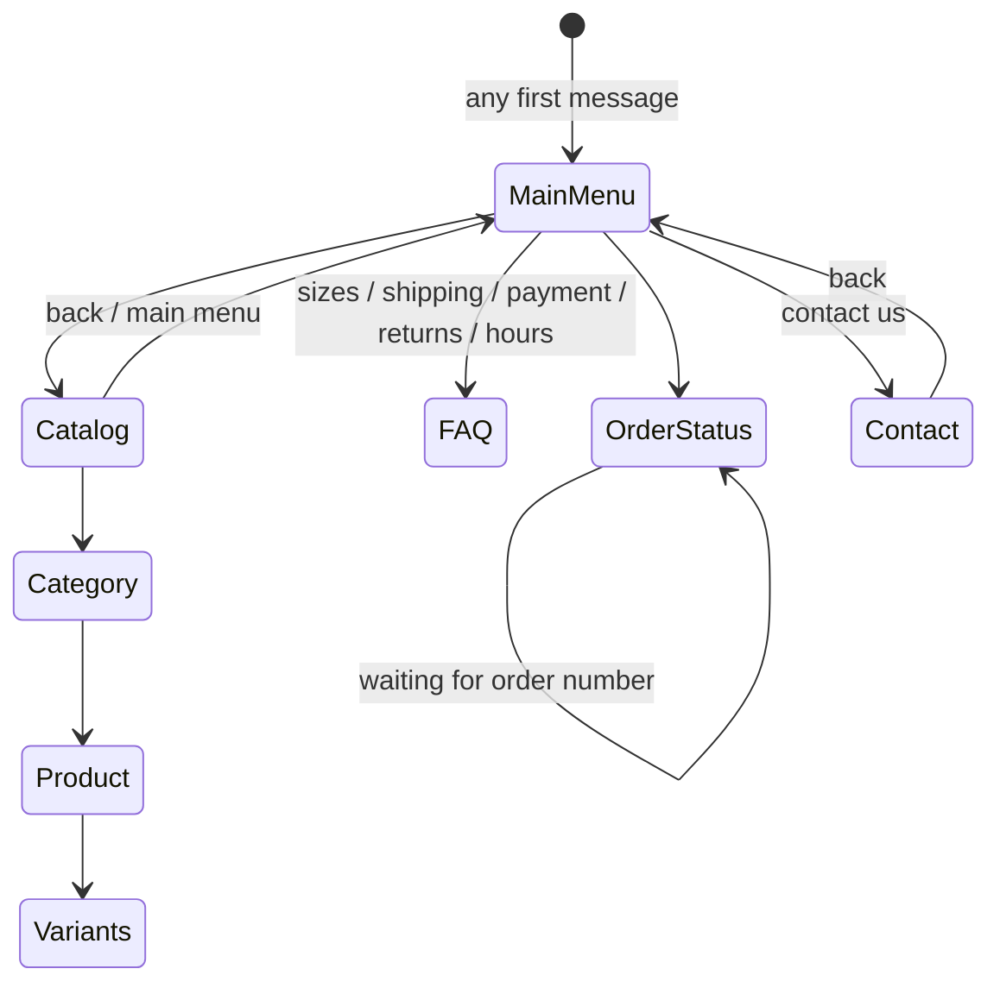

# 4. Conversation Design

> Updated after scoping: **Spanish only, menu-driven.** The bot always offers options and the customer answers by tapping one. See [ADR-0005](adr/0005-menu-driven-conversation.md).

## 4.1 Principle: guided conversation

The customer never has to guess what to type. Every bot message ends with tappable options that fit the current context. This gives us:

- Predictable, testable flows (a finite state machine, no hallucination risk)
- Zero LLM cost and fast replies
- Content that comes straight from the database (products, prices, sizes, stock)

Free text is still possible, so it is handled gracefully (see 4.5).

## 4.2 WhatsApp interactive message limits (drive the design)

| Type | Limit | Use for |
|---|---|---|
| **Reply buttons** | max **3** buttons, title max 20 chars | Short choices (Yes / No / Back) |
| **List message** | max **10** rows total, row title max 24 chars, one button opens it | Menus, categories, products |
| **Body text** | max 1024 chars | Answers |
| **Button/row id** | max 200 chars | Carries the navigation target, e.g. `menu:catalog` |

Rule: a list holds at most 10 rows, so **reserve 1 to 2 rows for navigation** ("Volver", "Menú principal"). Long catalogs are paginated ("Ver más").

## 4.3 Menu tree (draft, texts in Spanish)

```
Hola 👋 Bienvenido a <Tienda>. ¿En qué te puedo ayudar?   [List]
├── 👕 Ver catálogo
│   ├── Categoría (Básicas / Estampadas / Oversize ...)     [List, from DB]
│   │   └── Producto                                         [List, paginated]
│   │       └── Detalle: precio, material, foto
│   │           ├── Ver tallas y colores
│   │           │   └── Talla -> Color -> disponibilidad     [Buttons/List]
│   │           └── Volver | Menú principal
├── 📏 Guía de tallas                                         [Text + image]
├── 🚚 Envíos                                                 [Zones/costs/times, from DB or FAQ]
├── 💳 Formas de pago                                         [Text]
├── 🔁 Cambios y devoluciones                                 [Text]
├── 🕒 Horarios y ubicación                                   [Text]
├── 📦 Estado de mi pedido                                    [Asks order number (free text) -> lookup]
└── 📞 Contáctanos                                            [Text: phone, wa.me link, hours]
```

Every leaf ends with: **[Volver] [Menú principal] [Contáctanos]**.

The "Estado de mi pedido" option is the one place where free text is expected (the order number). It is optional in the MVP and needs the order data to come from somewhere (see doc 07).

### Catalog screens (data-driven)

| Screen | Option id | Shows |
|---|---|---|
| Categories | `go:catalog` | Active categories from the database |
| Products | `go:cat:<id>:<page>` | 7 products per page (list rows reserve room for Ver más / Volver / Menú), name, price and material |
| Detail | `go:product:<id>` | Name, price in soles, material, description, optional photo (button message header) |
| Sizes | `go:variants:<id>` | One row per size, listing the colors in stock, or "Agotada" |
| Stock | `go:stock:<id>:<size>` | Per color: disponible / ¡últimas unidades! (3 or fewer) / agotado. Exact numbers are never shown |

FAQ screens (sizes, shipping, payment, returns) read their text from `faq_entries`, falling back to a default, so the owner can change them without a deploy. On the 3-button product detail screen "Contáctanos" is omitted for lack of room; the keyword shortcuts still reach it.

## 4.4 State model

State is stored per conversation: a **current node** in the menu tree plus a small context (selected category, product, size, page, navigation stack).



Design choice: **button ids encode the target node** (for example `cat:12`, `prod:88`, `nav:back`). The engine can resolve a tap even if stored state is stale or lost, so conversations survive restarts and old messages still work.

Menu structure is **declarative** (a node registry: id, title, children, handler) and not hard-coded in if/else chains. Adding a menu option means adding a node.

## 4.4b Sessions

A conversation with no activity for **2 hours** is a new session: the next message, whatever it says, opens the main menu. A tap on an old menu is still honored, because option ids carry their own target.

## 4.5 Handling text that is not a tap

| Situation | Behavior |
|---|---|
| Greeting ("hola", "buenas") | Show the main menu |
| Matches a simple keyword ("envíos", "tallas", "precio", "humano", "menú") | Jump to that node (light keyword/fuzzy matching) |
| Order number while in OrderStatus | Process it |
| Anything else | "No te entendí 😅 Elige una opción:" and re-show the **current** menu |
| 2 consecutive failures | Offer **Contáctanos** |
| Unsupported type (audio, sticker, location) | Polite message and the menu |

No LLM is required for any of this. If wanted later, an LLM could be added as an optional fallback node (see roadmap, phase 7).

## 4.6 Contact us (no handoff mode)

There is no live human takeover. "Contáctanos" (also triggered by keywords such as "asesor", "persona", "humano", "llamar") replies with:

- The store's contact number and a click-to-chat link (`https://wa.me/51XXXXXXXXX`)
- Opening hours
- Buttons: [Menú principal]

Contact number, link and hours come from configuration/content, not code. The bot keeps working normally afterwards, so there is no state to pause or resume. See [ADR-0006](adr/0006-contact-us-instead-of-handoff.md).

## 4.7 WhatsApp-specific rules

- Replies are free within the **24h service window** after the customer's last message. Since this bot only reacts to customers, we stay inside it. Proactive messages need approved templates and are out of the MVP.
- Mark inbound messages as read; send replies in order.
- Messages are short, with emojis used sparingly and consistently.
- The first message of a new session is always the main menu.

## 4.8 Testing the conversation

- Unit tests per node: given (state, input) assert (next state, reply payload).
- A **path-coverage test** walks the whole menu tree from the seeded catalog and verifies that no node is a dead end, no list exceeds 10 rows and no title exceeds its character limit.
- Golden transcripts (recorded sample conversations) as regression tests.
